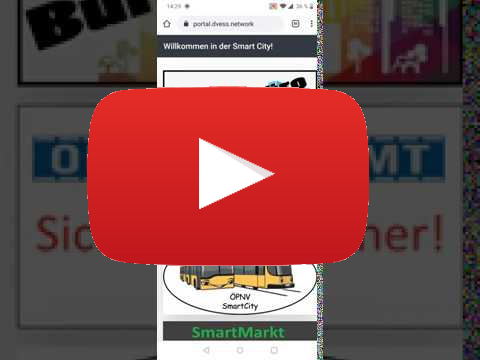

# MS_Strassenverkehrsamt

## Dienstleistungen
* Führerschein beantragen
* Wunschkennzeichen beantragen
* Kurzzeitkennzeichen bestellen
* Umweltplakette beantragen

## Messaging Topics
* Empfangen
  * Adressänderung
* Senden
  * Neue Ankündigung erstellt

## Microservice to Microservice
* Nutzen
  * Gebühren bezahlen
  * User Login
* Anbieten
  * Fahrzeughalter anhand Nummernschild abfragen
  * Führerschein für User abfragen

## Auswahl der Technologien
* Backend
  * Node.js
    * Express.js für REST
  * MongoDB
* Frontend
  * Nginx als statischer Webserver
    * Nuxt.js für SPA & PWA
    * Vue.js
    * Vuetify als CSS Framework

## PWA Preview auf YouTube

